import { Steps, Icon, Card, Badge,Aside } from '@astrojs/starlight/components';

<div class="ashara-meta-card">
  <strong>الجمهور المستهدف:</strong> مدراء النظام (Admin) <br />
  <strong>المسار:</strong> لوحة التحكم ➔ الإعدادات ➔ إعدادات الموقع
</div>

تعتبر صفحة **إعدادات المنصة** المحرك الأساسي لتهيئة كافة خصائص منصة "عشرة" (مثل العملاّت، بوابات الدفع، الإشعارات، والذكاء الاصطناعي). 

---

## 📍  طرق الوصول للوائح الإعدادات

<Steps>

1. **الطريقة الأولى: عبر القائمة الجانبية المباشرة**
   * من لوحة التحكم، اتجه إلى القائمة الجانبية الثابتة على اليسار.
   * اضغط على أيقونة **الإعدادات** <Icon name="setting" class="inline-icon" /> ليظهر لك شريط الخيارات السريعة، ثم اختر **إعدادات الموقع**.

   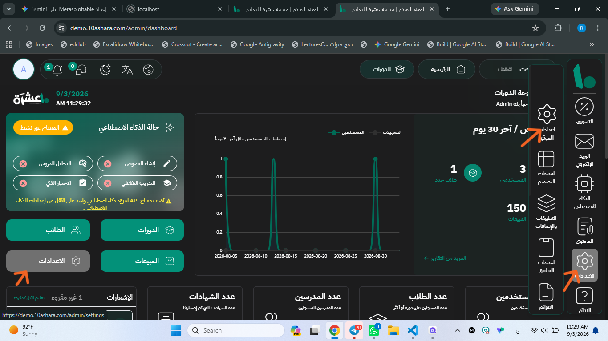

2. **الطريقة الثانية: عبر الاختصارات السريعة (Dashboard Widgets)**
   * من الصفحة الرئيسية للوحة التحكم، ستجد بطاقة كبيرة باسم **الإعدادات** <Icon name="config" class="inline-icon" />.
   * اضغط عليها مباشرة للتحويل الفوري إلى واجهة الإعدادات الشاملة.

   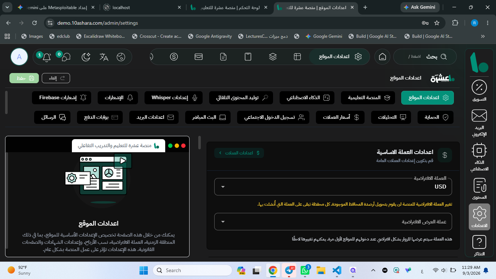

</Steps>

---

## 🗂️ نظرة عامة على تبويبات الإعدادات الرئيسية

تنتظم إعدادات منصة عشرة في التبويبات العلوية التالية:

| التبويب | الوظيفة الأساسية |
| :--- | :--- |
| **إعدادات الموقع** | ضبط العملات الافتراضية، الهوية، وإعدادات العرض العامة. |
| **المنصة التعليمية** | خيارات الكورسات، الشهادات، والدروس. |
| **الذكاء الاصطناعي** | ربط مفاتيح الـ API وتوليد المحتوى التلقائي والتفادي. |
| **بوابات الدفع والبريد** | ربط طرق الدفع الإلكتروني وسيرفرات إرسال الإيميلات. |

---

## ⚙️  تفاصيل إعدادات الموقع الأساسية

تتيح لك هذه اللوحة التحكم بالعملات، اللغات، صور المستخدمين، وشروط التسجيل:

<Steps>

1. ### ضبط عملات المنصة

   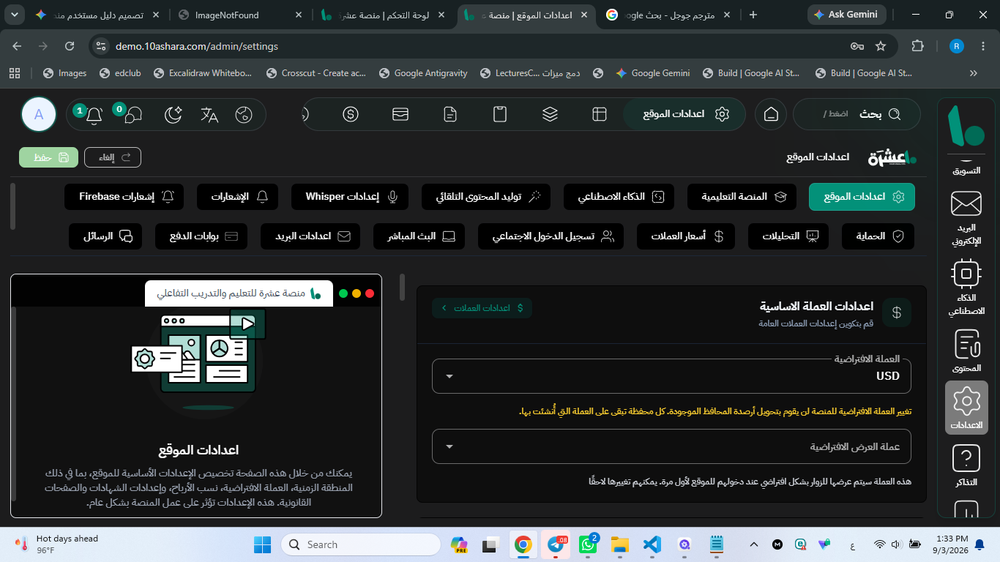

   * **العملة الافتراضية (Default Currency):**  
     **عملة الحسابات الأساسية خلف الكواليس:** هي العملة الحقيقية التي تُحفظ بها أسعار الكورسات في قاعدة البيانات والتقارير المالية للمنصة.
   * **عملة العرض الافتراضية (Display Currency):**  
     **عملة الشاشة للزائر:** هي العملة التلقائية التي تُعرض للزائر الجديد في واجهة المتجر، مع إمكانية تغييره لها لاحقاً.

   :::caution[ملاحظة مالية مهمة]
   تغيير **العملة الافتراضية** بعد إطلاق المنصة لن يقوم بتحويل المحافظ أو أسعار المحتوى الحالي تلقائياً، لذا يُفضل ضبطها بدقة قبل بدء المبيعات.
   :::

2. ### ترتيب اللغات المفعّلة ولغة الزيارة الأولى

   تتيح لك المنصة اختيار لغة واحدة أو عدة لغات لأكاديميتك، مع التحكم الكامل بآلية عرضها للزوار:

   .png)

   * **أهمية ترتيب اللغات (اللغة الأساسية والروابط):**  
     اللغة التي تضعها **في المركز الأول (أعلى القائمة)** هي **اللغة الأساسية للموقع** وتظهر فوراً على رابط الموقع الرئيسي المباشر (مثل `yoursite.com`)، بينما تُعرض باقي اللغات عبر مسارات فرعية مثل (`/en/` أو `/tr/`).

   .png)

   * **لغة فتح الموقع لأول مرة (سلوك الترحيب بالزائر):**  
     يمكنك اختيار **"الكشف التلقائي من المتصفح"** لتوجيه الزائر للغة جهازه تلقائياً، أو تحديد **لغة ثابته** تُفرض على كافة الزوار الجدد.

   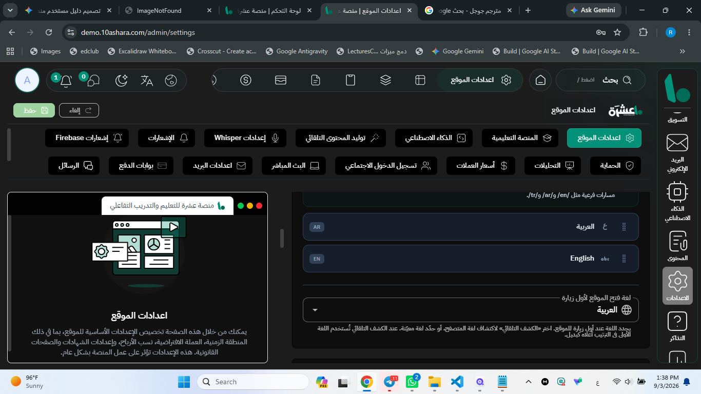

3. ### إعدادات الصور الرمزية (Avatars) للمستخدمين

   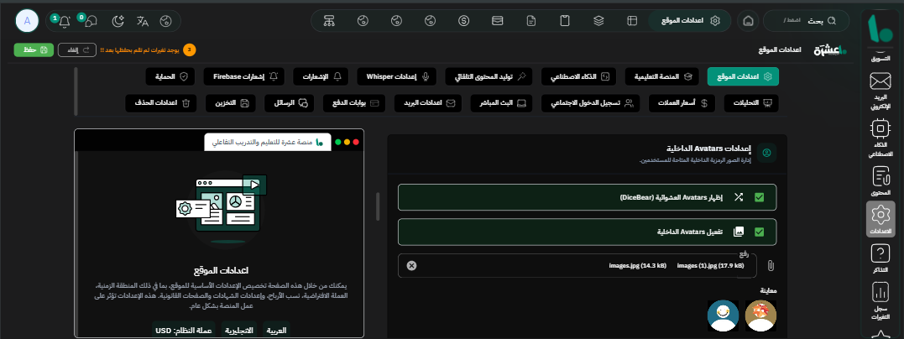

   * **إظهار Avatars العشوائية (DiceBear):** عند تفعيله، يتم توليد صور كرتونية تلقائية للطلاب الجدد.
   * **تفعيل Avatars الداخلي والرفع:** يتيح للمستخدمين رفع صورهم الشخصية من أجهزتهم أو الاختيار من الصور المتاحة.

4. ### معلومات التسجيل وعمولة المسوقين

   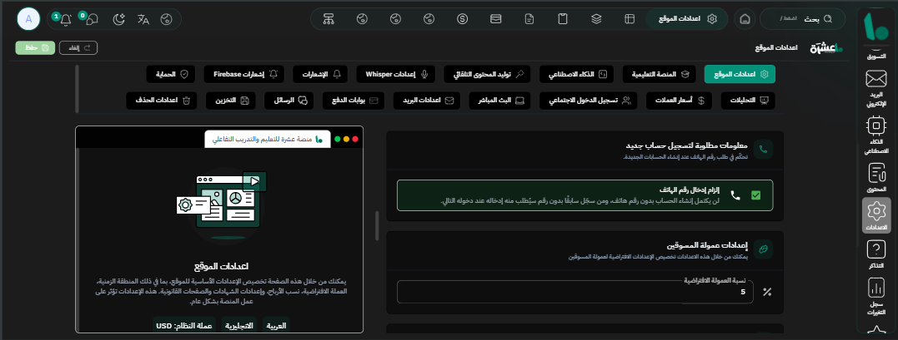

   * **إلزام إدخال رقم الهاتف:** يمنع إنشاء الحسابات أو استخدام المنصة دون إدخال رقم هاتف فعال.
   * **نسبة العمولة الافتراضية للمسوقين (%):** تحدد النسبة المئوية المباشرة التي يحصل عليها المسوق عند إحالة طالب جديد. <a href="#" title="اضغط هنا لقراءة الشرح الكامل لنظام التسويق بالعمولة" style="display: inline-flex; align-items: center; text-decoration: none; vertical-align: middle; margin-right: 4px;"><Icon name="information" size="1.1rem" color="var(--sl-color-ascent-high)" /></a>

5. ### إعدادات الصفحات القانونية

   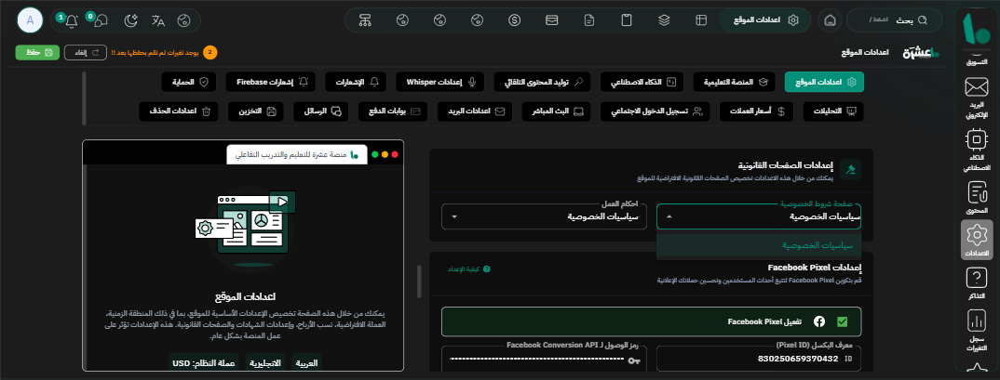

   * **ربط الصفحات القانونية (أحكام العمل وسياسة الخصوصية):** القائمة المنسدلة تتيح ربط صفحة مكتوبة مسبقاً لتكون هي الصفحة الرسمية للشروط وتظهر في أسفل الموقع (Footer).

6. ### إعدادات Facebook Pixel & Conversion API

   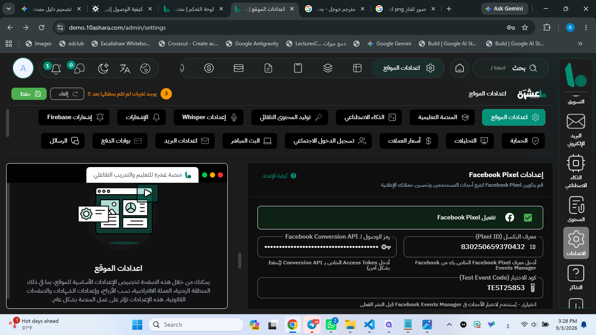

   تُستخدم هذه اللوحة لربط المنصة بحسابك الإعلاني على Meta وتتبع سلوك الزوار والطلاب (من المتصفح والسيرفر مباشرة عبر Conversions API) لضمان دقة التقارير الإعلانية:

   * **تفعيل Facebook Pixel:** المفتاح الرئيسي لتشغيل أو إيقاف التتبع عبر المنصة.
   * **معرف البيكسل (Pixel ID / Dataset ID):** الرقم التعريفي المخصص لموقعك على Meta.
   * **رمز الوصول (Access Token):** رمز الأمان الخاص بالربط المباشر من السيرفر (Conversions API).
   * **كود الاختبار (Test Event Code):** حقل اختياري يُستخدم للتأكد من استقبال الأحداث وتجربتها قبل إطلاق الحملات رسمياً.

   :::tip[كيف تجد خطوات الإعداد والتكامل التفصيلية؟]
   تتيح لك المنصة دليلاً تفصيلياً مدمجاً بداخلها! فقط اضغط على زر **"كيفية الإعداد"** الموجود أعلى كارت `Facebook Pixel` في لوحة التحكم، وسيظهر لك دليل تفاعلي يشرح خطوة بخطوة كيفية جلب الـ `Pixel ID` وتوليد الـ `Access Token` من حساب Meta Events Manager.
   :::

   ---

   **📊 الأحداث القياسية (Events) التي تتتبعها المنصة تلقائياً**

   فور إتمام عملية الربط، تقوم المنصة بإرسال الأحداث والتفاعلات التالية تلقائياً إلى حسابك في فيسبوك:

    | اسم الحدث (Event) | متى يُرسل للفيسبوك؟ | البيانات المرفقة |
    | :--- | :--- | :--- |
    | <Badge text="ViewContent" variant="note" /> | عند عرض صفحة كورس، موضوع حي، أو تخصص. | معرف الكورس، الاسم، السعر، الفئة. |
    | <Badge text="AddToCart" variant="caution" /> | عند إضافة الكورس إلى سلة الشراء. | معرف الكورس، السعر، الكمية. |
    | <Badge text="Purchase" variant="success" /> | عند إتمام عملية الشراء بنجاح. | رقم الطلب، المبلغ الإجمالي، العملة. |
    | <Badge text="PaymentFailed" variant="danger" /> | عند فشل عملية الدفع. | نوع الدفع، رسالة الخطأ. |
    | <Badge text="Contact" variant="tip" /> | عند إرسال نموذج التواصل أو WhatsApp. | طريقة التواصل. |
    | <Badge text="Lead" variant="success" /> | عند إرسال أي نموذج تسجيل أو استمارة. | نوع النموذج. |

7. ### إعدادات Google Tag Manager (GTM)

   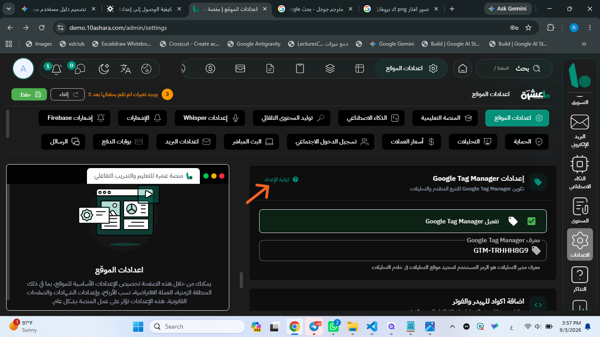

    :::info[ما هو Google Tag Manager ولماذا نحتاجه؟]
    هو نظام إدارة أوسمة مجاني من جوجل، يتيح لك إدارة وإضافة جميع أكواد التتبع والتحليلات (مثل Google Analytics 4, TikTok Pixel, Google Ads) في مكان واحد **دون الحاجة للتعديل على كود المنصة البرمجي** في كل مرة.   
    :::

    

    تتضمن هذه اللوحة الخيارات التالية لتفعيل التتبع المتقدم:

    * **تفعيل Google Tag Manager:** زر التفعيل أو الإيقاف الشامل لخدمة GTM على كافة صفحات المنصة.
    * **معرف Google Tag Manager:** الرمز التعريفي الخاص بالحاوية الخاصة بك على جوجل (يبدأ دائماً بـ `GTM-XXXXXXX`).

    :::tip[طريقة الإعداد والربط التفصيلية]
    يوفر النظام دليلاً تفصيلياً مدمجاً بداخل اللوحة! قم بالضغط على زر **"كيفية الإعداد"** الموجود في أعلى الكارت، وسيظهر لك دليل تفاعلي يشرح خطوات إنشاء الحساب، إنشاء الحاوية (Container)، وجلب المعرف، بالإضافة لطريقة اختبار الربط عبر الـ `dataLayer`.
    :::

    ---

   **📊 الأحداث المطبوعة تلقائياً في الـ DataLayer**

    تقوم المنصة تلقائياً بدفع التفاعلات والأحداث التالية إلى الـ `dataLayer` لتتمكن من التقاطها بسهولة عبر GTM وإرسالها لأي أداة تحليلات خارجية:

    | اسم الحدث (Event) | متى يُرسل؟ | البيانات المرفقة |
    | :--- | :--- | :--- |
    | <span style="background: #14b8a6; color: white; padding: 2px 10px; border-radius: 12px; font-weight: bold; font-size: 0.85rem;">pageview</span> | عند زيارة أي صفحة في المنصة. | عنوان الصفحة والمسار (Path). |
    | <span style="background: #3b82f6; color: white; padding: 2px 10px; border-radius: 12px; font-weight: bold; font-size: 0.85rem;">view_item</span> | عند عرض صفحات المنتجات والخدمات. | معرف الكورس/الموضوع، الاسم، السعر، الفئة. |
    | <span style="background: #f59e0b; color: white; padding: 2px 10px; border-radius: 12px; font-weight: bold; font-size: 0.85rem;">add_to_cart</span> | عند إضافة أي عنصر لسلة الشراء. | معرف الكورس، السعر، الكمية. |
    | <span style="background: #22c55e; color: white; padding: 2px 10px; border-radius: 12px; font-weight: bold; font-size: 0.85rem;">purchase</span> | عند إتمام عملية الشراء بنجاح. | رقم الطلب، المبلغ الإجمالي، العملة، قائمة المنتجات. |
    | <span style="background: #ef4444; color: white; padding: 2px 10px; border-radius: 12px; font-weight: bold; font-size: 0.85rem;">payment_failed</span> | عند فشل عملية الدفع. | نوع الدفع، رسالة الخطأ. |
    | <span style="background: #a855f7; color: white; padding: 2px 10px; border-radius: 12px; font-weight: bold; font-size: 0.85rem;">contact</span> | عند إرسال نموذج التواصل أو الانتقال لـ WhatsApp. | طريقة التواصل. |
    | <span style="background: #0d9488; color: white; padding: 2px 10px; border-radius: 12px; font-weight: bold; font-size: 0.85rem;">generate_lead</span> | عند تعبئة وإرسال أي نموذج تسجيل أو استمارة. | نوع النموذج. |

    :::note[الصفحات المدعومة بتتبع الأحداث التفصيلية]
    يتم إرسال الأحداث السابقة تلقائياً من الصفحات التالية: **صفحة الكورسات، صفحة المواضيع الحية، صفحة التخصصات الجامعية، صفحة الجامعات، وصفحات دفع اختبار التخصص**.
    :::

8.  ### اضافة اكواد للهيدر والفوتر

     يمكنك إضافة أكواد مخصصة للهيدر والفوتر للمنصة دون الحاجة للتعديل على الشفرة المصدرية للموقع:

    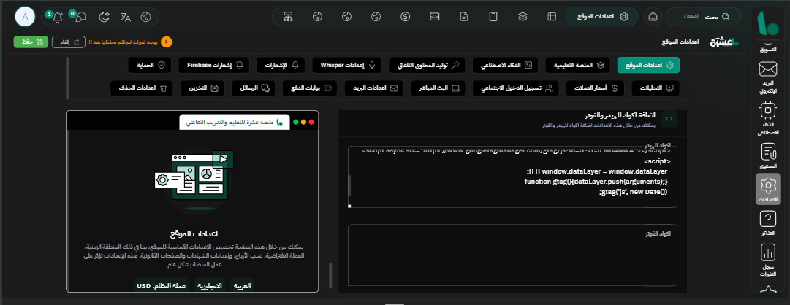

    

    * **أكواد الهيدر (Header Scripts):** تُحقن داخل وسم `<head>` في كافة صفحات المنصة. تُستخدم للأكواد التي تحتاج للتحميل والبدء المباشر مع تحميل الصفحة.
    * **أكواد الفوتر (Footer Scripts):** تُحقن قبل إغلاق وسم `</body>` في نهاية الصفحة. تُستخدم للسكريبتات والأدوات التفاعلية التي تعتمد على اكتمال عناصر الصفحة أولاً.

    :::info[اللغات البرمجية المدعومة]
    تقبل هذه الحقول أكواد **HTML** المباشرة، أنماط **CSS** (ضمن وسم `<style>`)، وسكريبتات **JavaScript** (ضمن وسم `<script>`).  
    *(ملاحظة: لا تدعم هذه الحقول لغات البرمجة الخاصة بالسيرفر مثل PHP أو Python).*
    :::

    ---

    **💡 نطاق تطبيق الأكواد وأمثلة عملية**

    يمكن التحكم في استهداف الأكواد وتطبيقها بحسب الحاجة:
    * **تطبيق عام على جميع الصفحات:** الأكواد المضافة هنا تنفذ عبر كافة صفحات المنصة تلقائياً (مثل أدوات التتبع والشات المباشر).
    * **استهداف صفحات معينة فقط:** يمكنك كتابة كود جافاسكريبت يفحص مسار الصفحة الحالي (Path) لتنفيذ النمط أو العنصر فقط في الصفحة الرئيسية أو صفحة كورس معين.

    ---

    **🧪 مثال عملي: إضافة شريط تنبيه وشريط خصومات أعلى المنصة**

    يمكنك نسخ وتجربة الكود التالي في حقل **"أكواد الهيدر"** لإظهار شريط عروض ترويجي أنيق كما هو موضح في الصورة:

    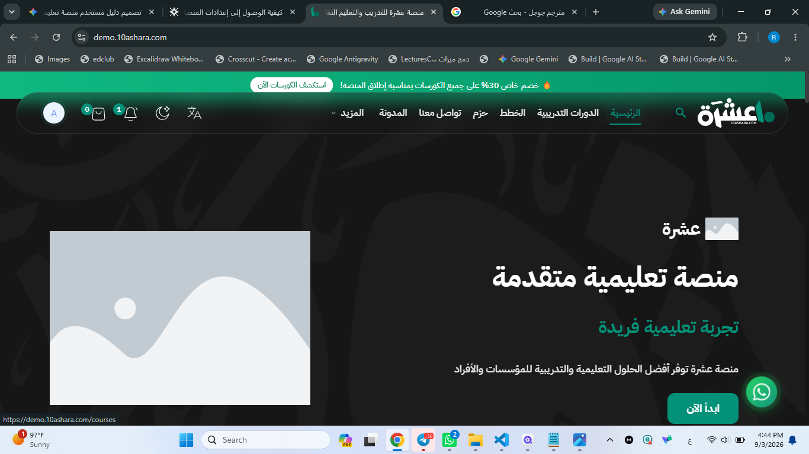

      ```html
    <style>
      .promo-bar {
         background: linear-gradient(90deg, #10b981 0%, #059669 100%);
         color: white;
         text-align: center;
         padding: 10px 15px;
        font-size: 14px;
        font-weight: 600;
        display: flex;
        justify-content: center;
        align-items: center;
        gap: 15px;
        
      }
      .promo-bar a {
        background-color: white;
        color: #047857;
        padding: 4px 12px;
        border-radius: 20px;
        text-decoration: none;
        font-size: 12px;
      }
    </style>

    <script>
      document.addEventListener("DOMContentLoaded", function() {
        const promoBanner = document.createElement("div");
        promoBanner.className = "promo-bar";
        promoBanner.innerHTML = `
          <span>🔥 خصم خاص 30% على جميع الكورسات بمناسبة إطلاق المنصة!</span>
          <a href="/courses">استكشف الكورسات الآن</a>
        `;
        document.body.prepend(promoBanner);
     });
    </script>
    
    ---

</Steps>

---

**🔄 كيفية إلغاء أو إزالة الأكواد المخصصة**

إذا أردت إيقاف أو مسح الكود المخصص في أي وقت:
1. قم بتحديد النص والكود الموجود داخل حقل الإدخال (الهيدر أو الفوتر) ومسحه بالكامل.
2. اضغط على زر **"حفظ التغييرات"** في أعلى اللوحة.
3. قم بعمل **إعادة تحميل (Refresh)** لموقع المنصة، وسيطبق الإعداد الجديد وتختفي التغيرات فوراً.

<Aside type="caution" title="تنبيه أمني">
تأكد دائماً من جلب الأكواد من مصادر معروفة وموثوقة، حيث إن الأكواد البرمجية الخاطئة قد تتسبب في بطء تحميل الصفحة أو تعطيل بعض الميزات التفاعلية.
</Aside>

---

## 🎓 إعدادات المنصة التعليمية (LMS Settings)

يُمكنك الوصول إلى هذا القسم عبر الانتقال إلى **الإعدادات ← إعدادات الموقع** ثم اختيار تبويب **"المنصة التعليمية"** من القائمة العلوية (`#lms_setting`).

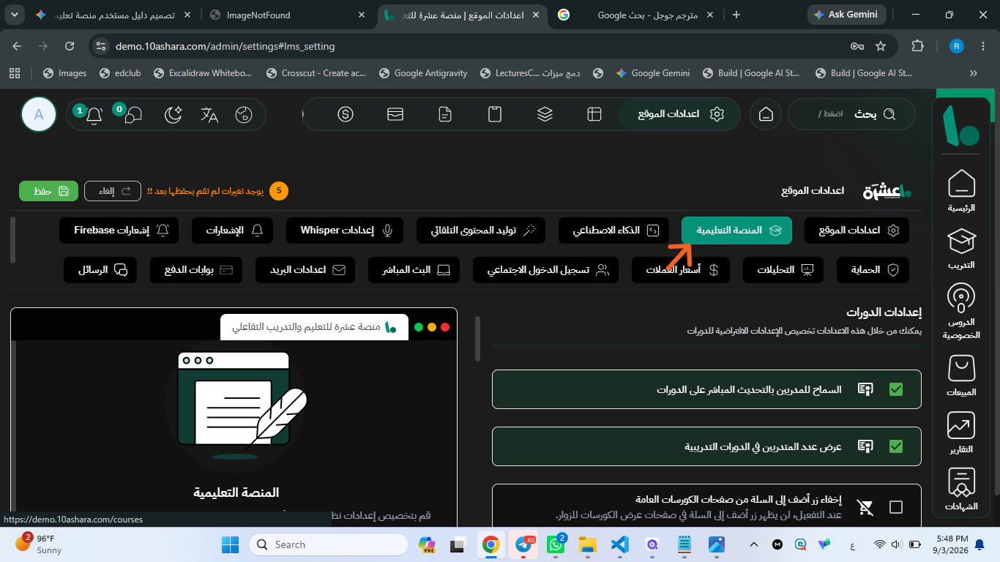

تُتيح لك هذه اللوحة التحكم في الخيارات التشغيلية لنظام إدارة التعلم (LMS)، وتتكون من الأقسام التالية:

---

<Steps>

1. ### خيارات عرض وتحديث الدورات التدريبية

   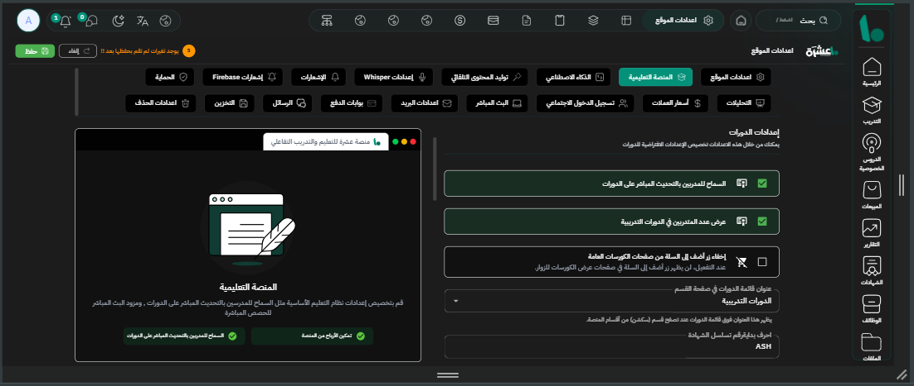

   * **السماح للمدربين بالتحديث المباشر على الدورات:**  
     عند تفعيل هذا الخيار، يتمكن المدربون من تعديل وتحديث محتوى دوراتهم بشكل مباشر ودون الحاجة لانتظار موافقة مسبقة من الإدارة.

   * **عرض عدد المتدربين في الدورات التدريبية:**  
     يُتيح إظهار عدد الطلاب المسجلين داخل صفحة التفاصيل الخاصة بالدورة للزوار والطلاب.

   * **إخفاء زر أضف إلى السلة من صفحات الكورسات العامة:**  
     عند التفعيل، لن يظهر زر "أضف إلى السلة" في صفحات عرض الكورسات للزوار، ويُستخدم هذا الخيار في حال كانت الدورات مجانية بالكامل أو تعتمد نظام التسجيل المباشر/التواصل.

2. ### عناوين العرض وتكامل الشهادات

   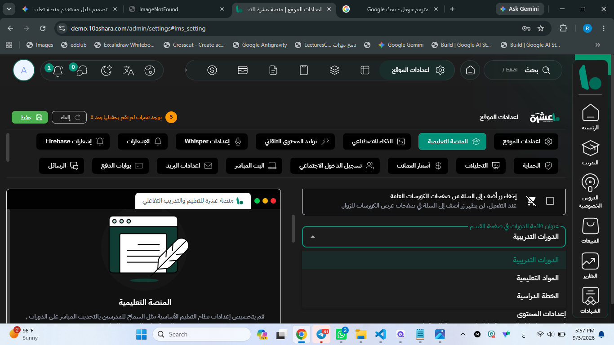

   * **عنوان قائمة الدورات في صفحة القسم:**  
     الحقل المخصص لتحديد النص الظاهر فوق قائمة الدورات عند تصفح قسم (سكشن) معين من أقسام المنصة (مثال الافتراضي: `الدورات التدريبية`).

   * **أحرف بداية رقم تسلسل الشهادة:**  
     تحديد بادئة كود الشهادة (Prefix) للشهادات الصادرة من المنصة (مثال: `ASH`) لضمان تمييز الأكواد التسلسلية للشهادات الصادرة للطلاب عند التحقق منها.

3. ### 📂 إعدادات المحتوى والمرفقات

    تحكم كامل في كيفية تفاعل الطلاب مع الملحقات والمواد الإثرائية المرفقة بالدروس:
    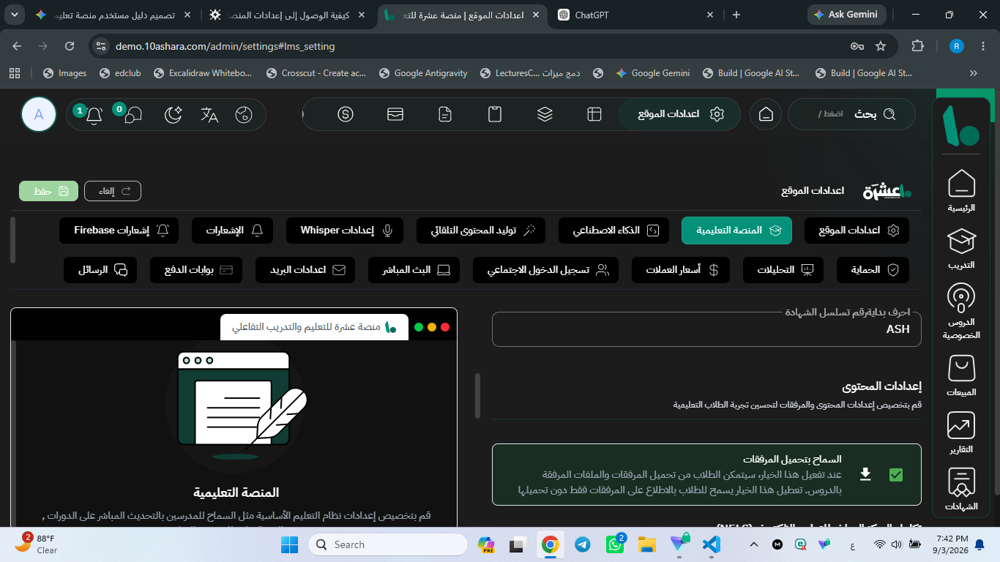

    | الإعداد | الحالة | الوظيفة والأثر التشغيلي |
    | :--- | :---: | :--- |
    | **السماح بتحميل المرفقات** | مفعل 🟩 | يتيح للطلاب تحميل الملفات والمستندات المرفقة بالدروس مباشرة إلى أجهزتهم. |
    | **تعطيل تحميل المرفقات** | معطل 🟥 | يُلزم الطلاب بالاطلاع على المرفقات ومعاينتها داخل المنصة فقط دون إمكانية تنزيلها (لحماية الملكية الفكرية). |

    ---

    **💡 خيارات سريعة للتفاعل والتعليم التفاعلي**

    <Aside title="تحديثات التدريب المباشر" type="note">
     تتيح الإعدادات المتقدمة في هذا القسم خيارات التحكم في صلاحيات المدرسين، مثل التحديث المباشر للدروس والتواصل التفاعلي مع الطلاب أثناء البث.
    </Aside>

    ---

4. ### 🇸🇦 تكامل المركز الوطني للتعليم الإلكتروني (NELC)

    يوفر هذا الخيار ربطاً اختيارياً لإرسال بيانات التسجيل، التقدم التعليمي، والشهادات الخاصة بكل عميل إلى سجل التعلم الخارجي (LRS)، وذلك لتلبية متطلبات الامتثال للمؤسسات التعليمية.

    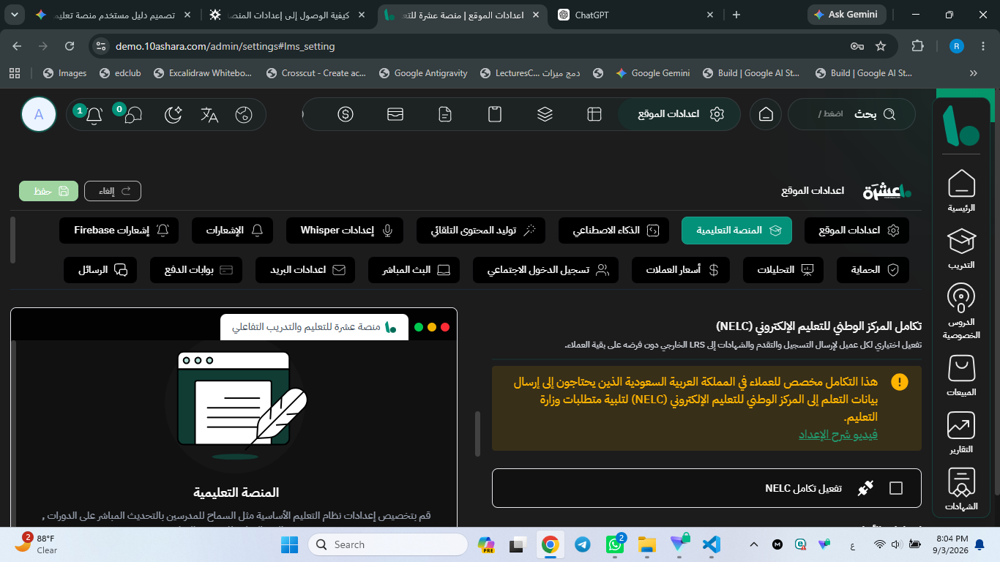

    <Aside type="caution" title="تنبيه هام للمؤسسات في المملكة العربية السعودية">
     هذا التكامل مخصص للعملاء داخل المملكة العربية السعودية الذين يحتاجون إلى إرسال بيانات التعلم إلى المركز الوطني للتعليم الإلكتروني (NELC) لتلبية متطلبات وزارة التعليم، ويمكن تفعيله اختيارياً دون فرضه على بقية العملاء.
    </Aside>

    | الإعداد | الخيار | الأثر التشغيلي |
    | :--- | :---: | :--- |
    | **تفعيل تكامل NELC** | مربع اختيار (Checkbox) 🔲 | عند تفعيله، يتم ربط المنصة فورياً بـ LRS الخارجي وتمرير بيانات المتعلمين المعتمدة. |
    <Aside type="tip" title="🎬 فيديو شرح الإعداد">
      تتيح لك الشاشة رابطاً مباشراً لـ **فيديو شرح الإعداد** داخل الواجهة، ليقودك خطوة بخطوة خلال عملية الربط وضبط الإعدادات المطلوبة بسهولة دون أي تعقيد تقني.
    </Aside>

5. ### 💰 إعدادات الأرباح (Profit Settings)

     هذا القسم يُعطيك **حرية كاملة في اختيار طريقة التعامل المالي مع المدربين**، سواء كنت تدير أكاديمية خاصة بمدربين يتقاضون رواتب ثابتة، أو تعمل بنظام "المتجر التعليمي المفتوح" الذي يتشارك فيه المدرب والمنصة في أرباح المبيعات.

    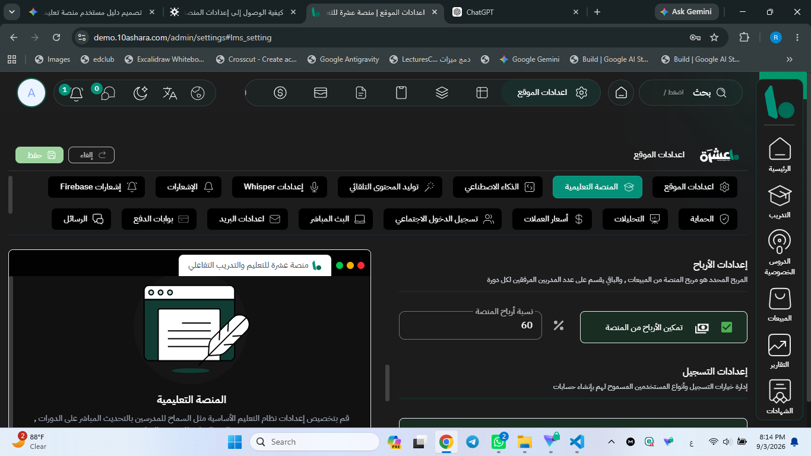

    **❓ كيف يعمل نظام الأرباح؟ (خياراتك كأدمن)**

    1. **الخيار الأول: عدم اقتطاع نسب (تعطيل الخيار ⬜)**
      * **متى تستخدمه؟** إذا كانت كافة الكورسات ملكاً للمؤسسة، أو إذا كان المدربون يتقاضون رواتب شهريّة ثابتة.
       * **النتيجة:** تذهب 100% من مبيعات الدورات لحساب المنصة مباشرة دون اقتطاع أو تقسيم آلي.

    2. **الخيار الثاني: تفعيل تقسيم الأرباح الآلي (تفعيل الخيار 🟩)**
       * **متى تستخدمه؟** إذا كنت تستقطب مدربين خارجيين وتتفق معهم على نسبة محددة من مبيعات دوراتهم.
       * **النتيجة:** يحسب النظام النسب تلقائياً فور كل عملية شراء ويُوزعها بين المنصة والمدربين.

    ---

    #### ⚙️ تفاصيل الحقول وكيفية حسابها

    * **تمكين الأرباح من المنصة:** زر تفعيل/تعطيل يُحدد ما إذا كان النظام سيقوم بحساب وتقسيم النسب أم لا.
    * **نسبة أرباح المنصة (%):** الحصة المئوية التي تأخذها المنصة من كل عملية بيع (مثلاً: إذا وضعت `60%`، فهذا يعني أن المنصة تأخذ 60% من قيمة الكورس، والمتبقي وهو `40%` يذهب للمدربين).
    * **آلية التوزيع التلقائي على المدربين:** 
    * إذا كان الكورس يدرّسه **مدرب واحد**: يحصل على المتبقي كاملاً (40%).
      * إذا كان الكورس يدرّسه **أكثر من مدرب (مثلاً مدربين اثنان)**: يُقسم المتبقي (40%) بينهما بالتساوي آلياً، فيحصل كل مدرب على (20%).

    <Aside type="tip" title="💡 مثال توضيحي للمبتدئين">
     سعر الكورس = 100 دولار.  
      نسبة المنصة المحددة = 60%.  
      * **حصة المنصة:** 60 دولار.  
      * **حصة المدربين المتبقية (40%):** 40 دولار (تُحول للمحفظة الداخلية للمدرب أو يُسجل حسابه بها آلياً).
    </Aside>

6. ### 📝 إعدادات التسجيل (Registration Settings)

    يتيح لك هذا القسم التحكم في تجربة انضمام المستخدمين الجدد للمنصة، وتحديد البيانات المطلوب جمعها أثناء عملية إنشاء الحساب، بالإضافة إلى فتح أو إغلاق التسجيل المباشر للمدربين.

    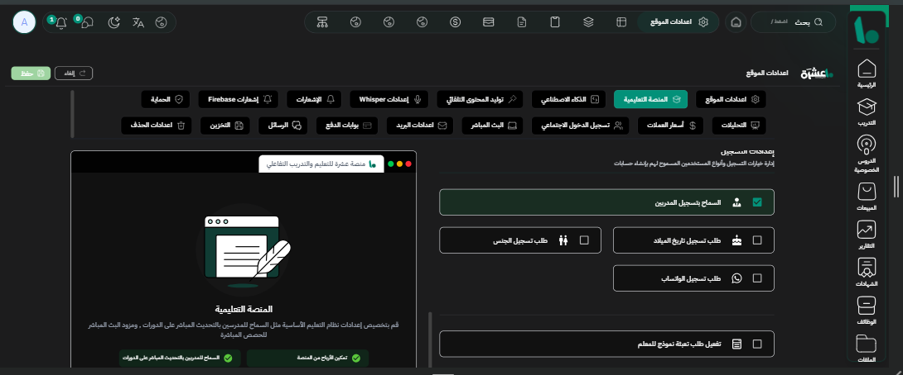

    #### ⚙️ خيارات وضوابط التسجيل المتاحة:

    * **السماح بتسجيل المدربين:** 
      * عند التفعيل 🟩: يظهر خيار "التسجيل كمدرب" في واجهة الموقع الخارجية، مما يتيح للمدرسين إنشاء حساباتهم والتقديم للمنصة مباشرة.
      * عند التعطيل 🟥: يتم إخفاء خيار تسجيل المدربين الجدد، ليقتصر إضافة المدربين على الأدمن فقط من داخل لوحة التحكم.

    * **طلب تسجيل تاريخ الميلاد (🎂):**
      * عند تفعيله، يصبح حقل "تاريخ الميلاد" متطلباً أساسياً أثناء إنشاء الحساب، وهو مفيد للأكاديميات التي تستهدف فئات عمرية محددة أو تقدم محتوى موجه.

    * **طلب تسجيل الجنس (🚻):**
      * عند تفعيله، يلتزم المستخدم بإنشاء الحساب بتحديد الجنس (ذكر/أنثى)، ويُستفاد منه في استخراج الإحصائيات الدقيقة أو توجيه المحتوى.

    * **طلب تسجيل الواتساب (💬):**
      * يتطلب من المستخدم إدخال رقم الواتساب المباشر أثناء التسجيل، مما يسهل عملية التواصل وإرسال التنبيهات والدعم الفني.

    * **تفعيل طلب تعبئة نموذج المعلم (📋):**
      * عند تفعيله، لا يتم قبول المدرب فور تسجيله بل يُطلب منه ملء نموذج تقديم إضافي (يحتوي على الخبرات، التخصصات، والسيرة الذاتية) لتقوم الإدارة بمراجعته والموافقة عليه قبل منحه صلاحيات التدريب.

    ---
</Steps>

---

## 💡 إعدادات المقولات اليومية (Daily Quotes)

يُمكنك الوصول إلى هذا القسم عبر التبويب الفرعي المباشر **"إعدادات المقولات اليومية"** المترابط مع شاشة المنصة التعليمية.

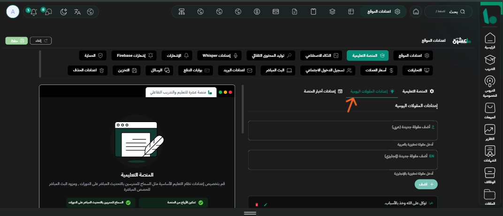

تُتيح لك هذه اللوحة تحفيز المتعلمين والزوار عبر إظهار مقولات تحفيزية وتطويرية يومية متجددة أعلى الواجهة الرئيسية للمنصة باللغتين العربية والإنجليزيّة.

---

<Steps>

1. ### ➕ إضافة مقولة جديدة

   لتزويد المنصة بمقولة ملهمة جديدة، قم بتعبئة الحقول التالية ثم الضغط على زر **"+ أضف"**:

   * **أضف مقولة جديدة (عربي):** نص المقولة التحفيزية باللغة العربية (مثال: `من جد وجد`).
   * **أضف مقولة جديدة (إنجليزي):** النص المترجم أو المقولة باللغة الإنجليزية للزوار المتصفحين باللغة الإنجليزية.

2. ### 📋 إدارة وقائمة المقولات المضافة

   تظهر جميع المقولات التي تم إدخالها سابقاً في قائمة سفليّة مخصصة للتحكم بها:

   * **التعديل (✏️):** لتحديث نص المقولة بالعربي أو الإنجليزي في أي وقت.
   * **الحذف (🗑️):** لإزالة المقولة نهائياً من العرض على واجهة المستخدمين.

</Steps>

---

## 📰 إعدادات أخبار المنصة (Platform News)

يُمكنك الوصول إلى هذا القسم عبر التبويب الفرعي الثالث **"إعدادات أخبار المنصة"** المتواجد ضمن تبويبات المنصة التعليمية العلوية.

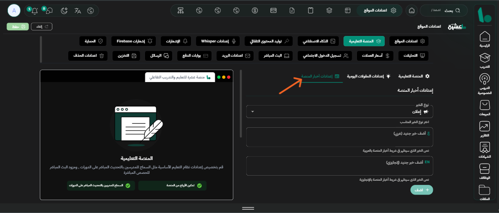

تُتيح لك هذه اللوحة بث التنبيهات، الإعلانات، والأخبار السريعة في الشريط الإخباري المعروض للطلاب والزوار أعلى الواجهة الرئيسية للمنصة باللغتين العربية والإنجليزيّة.

---

<Steps>

1. ### 🏷️ تحديد نوع الخبر (التصنيف)

   قم باختيار تصنيف الخبر المناسب من القائمة المنسدلة لتمييز نوع التنبيه بصريةً للمستخدمين:

   * **إعلان (📢):** للإعلان عن دورات جديدة، عروض، أو خصومات.
   * **تذكير (⏰):** للتذكير بمواعيد اللقاءات المباشرة أو الاختبارات.
   * **إنجاز (🏆):** لمشاركة إنجازات الأكاديمية أو وصول عدد الطلاب لرقم معين.
   * **تحديث (🔄):** لتنبيه المستخدمين بتحديثات جديدة في المنصة أو المحتوى.
   * **موعد نهائي (⏳):** للتنبيه بقرب انتهاء التسجيل أو الخصومات.

2. ### ✍️ إضافة نص الخبر باللغتين (+ أضف)

   قم بتعبئة نص الخبر المراد ظهوره في الشريط المتحرك:

   * **أضف خبر جديد (عربي):** النص الظاهر للزوار عند تصفح المنصة باللغة العربية.
   * **أضف خبر جديد (إنجليزي):** النص المترجم للزوار عند اختيار اللغة الإنجليزية.

   بعد استكمال البيانات، اضغط على زر **"+ أضف"** لإدراج الخبر فوراً في شريط الأخبار.

3. ### 📋 إدارة الأخبار المنشورة

   تظهر جميع الأخبار المضافة سابقاً في قائمة سفليّة، حيث يمكنك:
   * **التعديل (✏️):** لتحديث نص الخبر أو تعديل نوعه.
   * **الحذف (🗑️):** لإزالة الخبر نهائياً من شريط الأخبار العادي.

</Steps>

---

## 🤖 إعدادات الذكاء الاصطناعي (AI Settings - العام)

يُمكنك الوصول إلى هذا القسم عبر اختيار تبويب **"الذكاء الاصطناعي"** من الشريط العلوي (`#AiSetting`) والتأكد من تحديد تبويب **"عام"** من القائمة الجانبية لإعدادات المنصة.

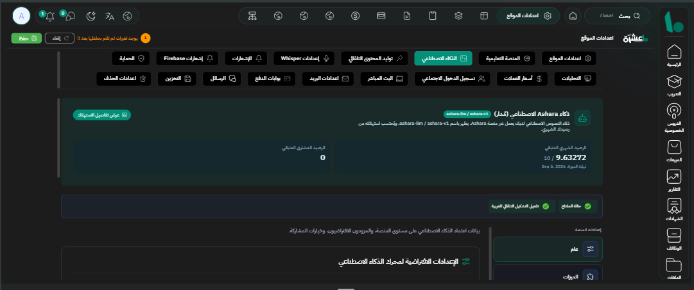

تُتيح لك هذه اللوحة إدارة ربط محركات الذكاء الاصطناعي المُختلفة بالمنصة، متابعة استهلاك الرصيد المباشر، وتعيين المزود الافتراضي لكل عملية تلقائية (توليد النصوص، الصور، التفريغ الصوتي، والتضمين).

---

<Steps>

1. ### 📊 الرصيد واستهلاك الذكاء الاصطناعي (Ashara AI)

   تظهر في أعلى الشاشة بطاقة ملخص استهلاك نموذج **ذكاء Ashara الاصطناعي (مُدلل / `ashara-llm / ashara-v1`)**:

   * **الرصيد الشهري المتبقي:** يعرض المتبقي من الحصة الشهرية المخصصة لمنصتك (مثال: `9.63 / 10`).
   * **الرصيد المشترى المتبقي:** يوضح أي باقات أو رصيد إضافي تم شراؤه لحساب المنصة.
   * **زر عرض تفاصيل الاستهلاك:** يتيح لك الاطلاع على السجلات التفصيلية لاستخدام الذكاء الاصطناعي والعمليات المُنفذة.

2. ### ⚙️ مفاتيح التحكم السريعة

   تتضمن اللوحة مفتاحين سريعين لأداء المحرك:
   * **حالة المفتاح:** لإظهار حالة اتصال وتفعيل مفاتيح ה-API الخاصة بالخدمة.
   * **تفصيل التشكيل التلقائي للعربية:** خيار مخصص لضبط معالجة التشكيل وتنسيق النصوص العربية المولّدة.

3. ### 🎛️ الإعدادات الافتراضية لمحرّك الذكاء الاصطناعي

   يُمكنك تخصيص مزود الخدمة المفضل لكل مهمة برمجية بداخل المنصة عبر القوائم المنسدلة:

   * **المزود الافتراضي للنصوص:** تحديد المزود المسؤول عن توليد النصوص والمحتوى (مثل: `ذكاء Ashara الاصطناعي (مُدلل)` أو `Anthropic`).
   * **المزود الافتراضي للصور:** اختيار المزود المسؤول عن إنشاء الصور للدروس والمقالات (مثل: `Gemini`).
   * **المزود الافتراضي للتفريغ الصوتي:** اختيار المزود المسؤول عن تحويل الصوت إلى نصوص (مثل: `OpenAI`).
   * **المزود الافتراضي للصوت:** اختيار المزود المسؤول عن تحويل النصوص إلى كلام صوتی (مثل: `OpenAI`).
   * **المزود الافتراضي للتضمين (Embeddings):** تحديد المحرك المسؤول عن معالجة النصوص وربط البحث الذكي (مثل: `OpenAI`).
   * **المزود الافتراضي لإعادة الترتيب (Rerank):** اختيار المحرك المسؤول عن إعادة ترتيب نتائج البحث والتحسين (مثل: `Cohere`).


4. ### 🧩 إعدادات أزرار مشاركة الذكاء الاصطناعي(AI Features)

    يُمكنك الوصول إلى هذا القسم عبر تبويب **"الذكاء الاصطناعي"** العلوّي ثم اختيار التبويب الفرعي **"الميزات"** من القائمة الجانبية المخصصة للإعدادات.

    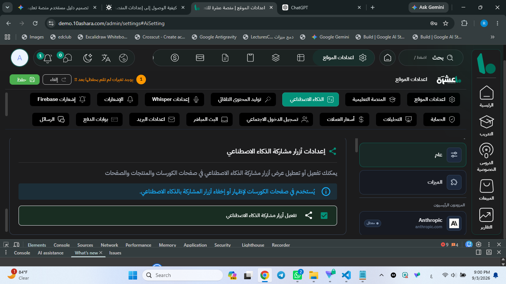

    تُتيح لك هذه اللوحة التحكم في الخيارات والتفاعلات الخاصة بالذكاء الاصطناعي المعروضة للزوار والطلاب في واجهة المنصة الخارجية.

    ---


     **🔗 إعدادات أزرار مشاركة الذكاء الاصطناعي**

       تتيح لك هذه اللوحة التحكم في إظهار أو إخفاء خيارات مشاركة المحتوى عبر أدوات الذكاء الاصطناعي في صفحات الكورسات والمنتجات والصفحات العامة:

       * **تفعيل أزرار مشاركة الذكاء الاصطناعي (مربع الاختيار 🔲):**
         * **عند التفعيل 🟩:** تظهر أزرار المشاركة المباشرة في صفحات الكورسات والمنتجات والصفحات، مما يتيح للزوار والطلاب مشاركة رابط الدورة أو محتواها بسهولة عبر أدوات الذكاء الاصطناعي.
        * **عند التعطيل 🟥:** يتم إخفاء أزرار المشاركة بالكامل من جميع صفحات المنصة العامة.

       :::info[نطاق التطبيق]
       يُستخدم هذا الإعداد خصيصاً في **صفحات الكورسات والمنتجات والصفحات** لإظهار أو إخفاء أزرار المشاركة بالذكاء الاصطناعي فور تفعيله أو تعطيله.
       :::


</Steps>

---
---

## 🧙‍♂️قسم الميزات 

يُمكنك الوصول إلى هذا القسم عبر تبويب **"الذكاء الاصطناعي"** في الشريط العلوي، ثم اختيار تبويب **"الميزات"** من الشريط الفرعي.

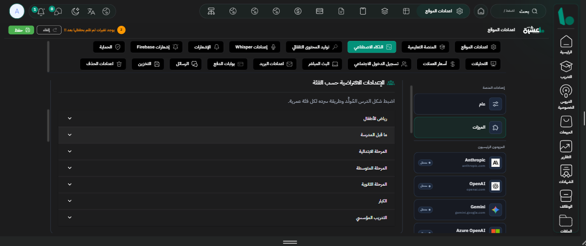
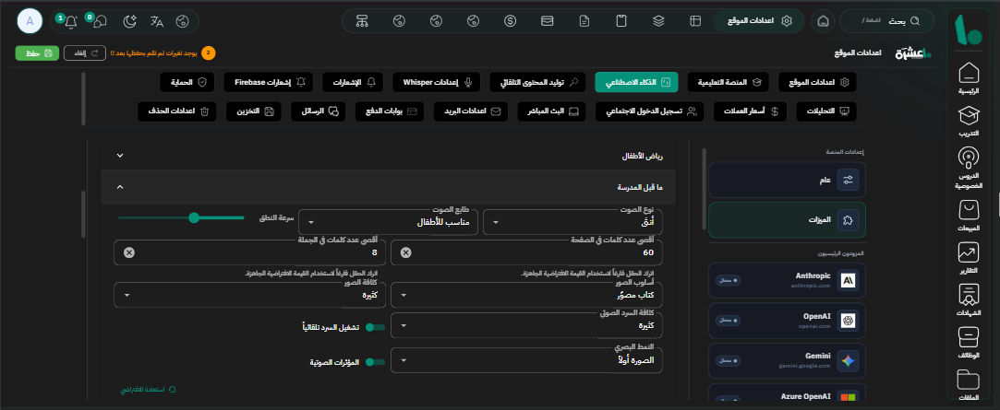

تُتيح لك هذه اللوحة ضبط أسلوب وشكل الدرس المُولّد تلقائياً بالذكاء الاصطناعي لكل فئة عمرية أو مرحلة تعليمية على حدة، لضمان ملاءمة النصوص، الأصوات، والصور للجمهور المستهدف.

---

### 👥 الفئات العمرية المتاحة للضبط

يتم تقسيم الإعدادات الافتراضية عبر قوائم منسدلة لكل مرحلة:
* **رياض الأطفال**
* **ما قبل المدرسة**
* **المرحلة الابتدائية**
* **المرحلة المتوسطة**
* **المرحلة الثانوية**
* **الكبار**
* **التدريب المؤسسي**

---

<Steps>

1. ### 🎙️ إعدادات الصوت والسرد الصوتي

   تسمح لك بتحديد كيفية نطق المحتوى الصوتي وطابعه لكل فئة:
   * **نوع الصوت:** اختيار جنس أو نبرة الصوت (مثل: `أنثى`، `ذكر`، أو `بدون تفضيل`).
   * **طابع الصوت:** تحديد أسلوب النطق المناسب للفئة (مثل: `مناسب للأطفال`، `ودود`، `راوٍ`، `رسمي`، `واضح`).
   * **سرعة النطق:** شريط سحب لضبط سرعة القراءة الصوتية (من البطيء إلى السريع).
   * **تشغيل السرد تلقائياً (مفتاح تبديل 🔘):** تفعيل أو تعطيل التشغيل الصوتي المباشر بمجرد فتح الدرس.
   * **المؤشرات الصوتية (مفتاح تبديل 🔘):** تفعيل المؤشرات والمؤثرات الصوتية أثناء قراءة النص.

2. ### 📝 إعدادات النصوص وكثافة المحتوى

   تتيح لك التحكم في طول النصوص وهيكلة الجمل داخل كل صفحة:
   * **أقصى عدد كلمات في الصفحة:** تحديد الحد الأقصى للكلمات في الصفحة الواحدة للدرس (مثل: `40` لرياض الأطفال، `60` لما قبل المدرسة، `120` للابتدائية).
   * **أقصى عدد كلمات في الجملة:** تحديد طول الجملة الواحدة لضمان السهولة والفهم (مثل: `6` كلمات، `8` كلمات، أو `10` كلمات).

3. ### 🎨 إعدادات النمط البصري والصور

   تتيح تخصيص أسلوب الصور المُولّدة وكثافتها:
   * **أسلوب الصور:** اختيار النمط الفني للصور المولّدة (مثل: `كتاب مصور`، `رسوم كرتونية بسيطة`، `رسوم توضيحية متقدمة`، `صور احترافية`).
   * **كثافة الصور:** تحديد مدى تكرار وتواجد الصور داخل المحتوى (مثل: `بدون`، `قليلة`، `متوسطة`، `كثيرة`، `في كل صفحة`).
   * **كثافة السرد الصوتي:** تحديد مدى تفصيل السرد الصوتي (مثل: `متوسطة` أو `كثيرة`).
   * **النمط البصري:** تحديد أولوية العرض في الواجهة (مثل: `الصورة أولاً`، `قياسي`، أو `موجه`).

</Steps>

---

:::tip[إعادة الضبط]
تحتوي كل فئة عمرية على خيار **"استعادة الافتراضي"** في أسفل القائمة لإعادة ضبط كافة قيم المرحلة إلى الإعدادات الأساسية للمنصة.
:::
